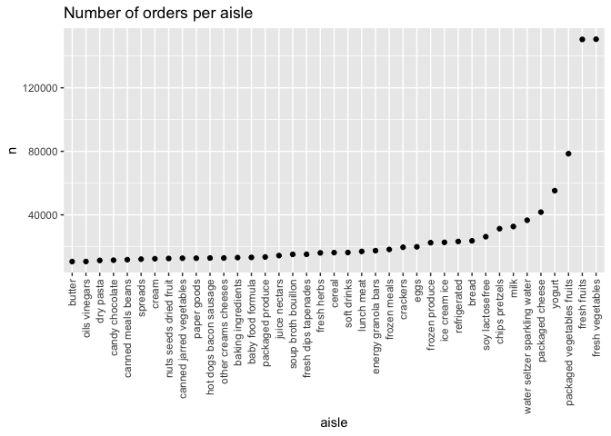
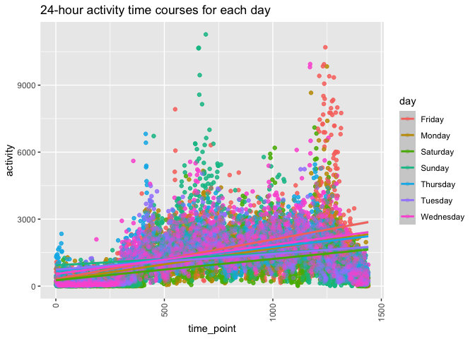
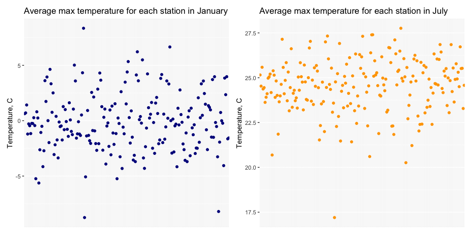
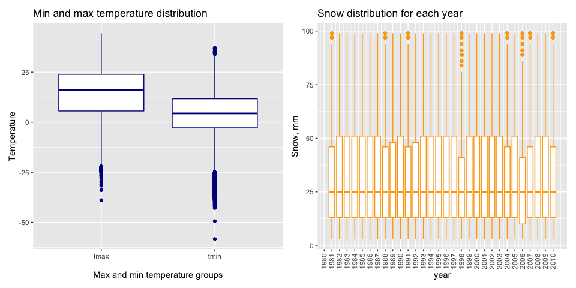

p8105\_hw3\_ao2671
================
ao2671
10/6/2020

# Problem 1

## Instacart description

There are 134 aisles. The aisles with the most ordered items are fresh
vegetables, fresh fruits, packaged vegetables fruits, yogurt

Instacart dataset describes the orders in the Instacart system. It has
the following variables: order\_id, product\_id, add\_to\_cart\_order,
reordered, user\_id, eval\_set, order\_number, order\_dow,
order\_hour\_of\_day, days\_since\_prior\_order, product\_name,
aisle\_id, department\_id, aisle, department. There is a total of 131209
orders by 131209 buyers from 21 departments. Orders can have multiple
products in them. The dataset also contains the information on the
aisles and departments for products purchased. There are 39123 unique
products purchased. The most popular products purchased is Banana, most
popular aisle is fresh vegetables and the most popular department is
produce. Orders are placed from 0 to 23 hours of day.

## Plotting the number of orders per aisle in aisles with more than 10,000 orders

``` r
instacart %>% count(aisle) %>% filter(n>10000) %>%
mutate(aisle = factor(aisle),
       aisle = fct_reorder(aisle, n)) %>%
ggplot(aes(x = aisle, y = n)) +
geom_point() +
theme(axis.text.x = element_text(angle = 90, vjust = 0.5, hjust = 1)) +
labs(title = "Number of orders per aisle" )
```

<!-- -->

## Top 3 products within “baking ingredients”,“dog food care” and “packaged vegetables fruits” aisles.

``` r
instacart %>% filter(aisle %in% c("baking ingredients","dog food care","packaged vegetables fruits")) %>%
group_by(aisle) %>%
count(product_name) %>%
mutate(rank=min_rank(desc(n))) %>%
filter(rank<4)%>%
arrange(aisle,rank)  
```

    ## # A tibble: 9 x 4
    ## # Groups:   aisle [3]
    ##   aisle                    product_name                                  n  rank
    ##   <chr>                    <chr>                                     <int> <int>
    ## 1 baking ingredients       Light Brown Sugar                           499     1
    ## 2 baking ingredients       Pure Baking Soda                            387     2
    ## 3 baking ingredients       Cane Sugar                                  336     3
    ## 4 dog food care            Snack Sticks Chicken & Rice Recipe Dog T…    30     1
    ## 5 dog food care            Organix Chicken & Brown Rice Recipe          28     2
    ## 6 dog food care            Small Dog Biscuits                           26     3
    ## 7 packaged vegetables fru… Organic Baby Spinach                       9784     1
    ## 8 packaged vegetables fru… Organic Raspberries                        5546     2
    ## 9 packaged vegetables fru… Organic Blueberries                        4966     3

## Mean hour of the day at which Pink Lady Apples and Coffee Ice Cream are ordered on each day of the week

``` r
instacart %>% 
filter(product_name %in% c("Pink Lady Apples","Coffee Ice Cream")) %>%
group_by(product_name,order_dow) %>%
summarize(mean_hour = mean(order_hour_of_day))  %>%
pivot_wider(
  names_from = order_dow,
  values_from = mean_hour
)  %>%
rename( "Mon" = "0", "Tue" = "1","Wed" = "2","Thu" = "3","Fri" = "4","Sat" = "5","Sun" = "6")
```

    ## # A tibble: 2 x 8
    ## # Groups:   product_name [2]
    ##   product_name       Mon   Tue   Wed   Thu   Fri   Sat   Sun
    ##   <chr>            <dbl> <dbl> <dbl> <dbl> <dbl> <dbl> <dbl>
    ## 1 Coffee Ice Cream  13.8  14.3  15.4  15.3  15.2  12.3  13.8
    ## 2 Pink Lady Apples  13.4  11.4  11.7  14.2  11.6  12.8  11.9

# Problem 2

``` r
accel_data <- read_csv("./data/accel_data.csv") %>%  
   rename_at(vars(matches("^activity.")), ~ str_remove(., "^activity.")) %>% 
    mutate(weekday_vs_weekend = case_when(
                               day == "Saturday" | day == "Sunday" ~ "weekend",
                               TRUE                                ~ "weekday"
                                        )
    ) %>%
    relocate(week, day_id, day, weekday_vs_weekend ) %>%
    mutate_at(5:1144, as.numeric)
```

## Description of the accelerometer dataset

Accelerometer dataset describes the activity of a man along a course of
three weeks. There are 35 rows, each of them represents one day with
activity for each second of the day. We added additional column
weekday\_vs\_weekend to indicate if a day is a weekday or weekend.

``` r
accel_data %>% 
  mutate(
    sum_day = rowSums(select(accel_data, 5:1144))
  ) %>% 
  select(week, day_id, day, weekday_vs_weekend, sum_day) 
```

    ## # A tibble: 35 x 5
    ##     week day_id day       weekday_vs_weekend sum_day
    ##    <dbl>  <dbl> <chr>     <chr>                <dbl>
    ##  1     1      1 Friday    weekday            257639.
    ##  2     1      2 Monday    weekday              4921.
    ##  3     1      3 Saturday  weekend            305456 
    ##  4     1      4 Sunday    weekend            543328 
    ##  5     1      5 Thursday  weekday            267276.
    ##  6     1      6 Tuesday   weekday            245143.
    ##  7     1      7 Wednesday weekday            266028.
    ##  8     2      8 Friday    weekday            360616 
    ##  9     2      9 Monday    weekday            222404 
    ## 10     2     10 Saturday  weekend            379189 
    ## # … with 25 more rows

In each week, there is one day where the activity is minimal (Monday on
Week 1 and Saturdays on Week 2 and 3). It seems that for Saturdays on
Week 2 and 3 the activity was not tracked (1 per each minute).

## Plotting daily activity

``` r
accel_data %>% 
  pivot_longer(
    5:1444,
    names_to = "time_point",
    values_to = "activity"
  ) %>% 
  mutate(time_point = as.numeric(time_point))%>%
  group_by(day,time_point) %>%
  mutate(activity = sum(activity)) %>% # grouping by day to reduce dimensions
  distinct (week, day, activity, time_point) %>%
  ggplot(aes(x = time_point, y = activity, color = day)) +
  geom_point(alpha = .3) + 
  geom_smooth(method = "lm") +
  theme(axis.text.x = element_text(angle = 90, vjust = 0.5, hjust = 1)) +
  labs (title = "24-hour activity time courses for each day")
```

    ## `geom_smooth()` using formula 'y ~ x'

<!-- -->

There is an overall increase in activity by the end of the day,
especially on Friday. Additionally, there is an increase in activity
around noon on Sunday. We can see that this man usually sleeps till \~
6AM as there is no activity till this time (except for Thursday when we
see some random activity).

# Problem 3

The dataset contains the information from the NOAA National Climatic
Data Center. It has 2595176 rows (observatons) and 7 columns and the
following variables: id, date, prcp, snow, snwd, tmax, tmin. Id
represents a station and provides information about snow, precipitation
and temperature at a given data. There is a lot of missing data: 145838
missing precipitation rows, 381221 missing snow rows, and 2268778 total
missing temperature rows.

``` r
cleaned_noaa <- 
ny_noaa %>%
janitor::clean_names() %>%
drop_na()%>%
mutate_at(vars(date), funs(year, month, day))%>%
filter (snow>=0 & prcp >=0) %>% # ensure that snow and precipitation are not negative
mutate(tmax = as.numeric(tmax)/10, # converting to numeric and to C
       tmin = as.numeric(tmin)/10,
       year = as.numeric(year)) %>% 
select (id, day, month, year, prcp, snow, snwd, tmin, tmax) 
```

    ## Warning: `funs()` is deprecated as of dplyr 0.8.0.
    ## Please use a list of either functions or lambdas: 
    ## 
    ##   # Simple named list: 
    ##   list(mean = mean, median = median)
    ## 
    ##   # Auto named with `tibble::lst()`: 
    ##   tibble::lst(mean, median)
    ## 
    ##   # Using lambdas
    ##   list(~ mean(., trim = .2), ~ median(., na.rm = TRUE))
    ## This warning is displayed once every 8 hours.
    ## Call `lifecycle::last_warnings()` to see where this warning was generated.

The most common mm of snowfall is 0 because there were more days without
snow throughout a year.

``` r
January <-
  cleaned_noaa %>%
  filter(month == "1") %>%
  group_by(id) %>%
  summarize(mean_temp = mean(tmax)) %>%
  ggplot(aes(x = id, y = mean_temp)) +
  geom_point(color = "darkblue")+
  theme(axis.title.x=element_blank(),
        axis.text.x=element_blank(),
        axis.ticks.x=element_blank()) +
  labs(title = "Average max temperature for each station in January",
       x = "Station",
       y = "Temperature, C")

July <-
  cleaned_noaa %>%
  filter(month == "6") %>%
  group_by(id) %>%
  summarize(mean_temp = mean(tmax)) %>%
  ggplot(aes(x = id, y = mean_temp)) +
  geom_point(color = "orange") +
  theme(axis.title.x=element_blank(),
        axis.text.x=element_blank(),
        axis.ticks.x=element_blank()) +
  labs(title = "Average max temperature for each station in July",
       x = "Station",
       y = "Temperature, C")  

January+July
```

<!-- -->

There are outliers: a couple of stations that recorded extremele low
temperature in Jan and one - high.In July there is only one station with
temperature below 17.5 C.

``` r
library(patchwork)
temp <-
  cleaned_noaa %>%
  select (tmin, tmax) %>%
  pivot_longer(
    tmax:tmin,
    names_to = "observation", 
    values_to = "temp") %>%
  ggplot(aes(x = observation, y =  temp)) +
  geom_boxplot(color = "darkblue")+
  labs(title = "Min and max temperature distribution",
       y = "Temperature",
       x = "Max and min temperature groups")

snow <-
  cleaned_noaa %>%
  filter(snow > 0 & snow < 100) %>%
  ggplot(aes(x = year, y = snow, group = year)) +
  geom_boxplot(color = "orange")+
  scale_x_continuous(breaks=seq(1980, 2010, 1)) +
  theme(axis.text.x = element_text(angle = 90, vjust = 0.5, hjust = 1)) +
  labs(title = "Snow distribution for each year",
       y = "Snow, mm")  

temp+snow
```

<!-- -->
